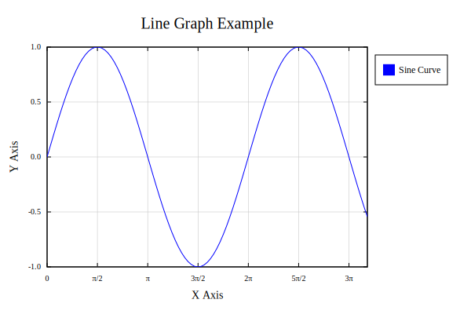
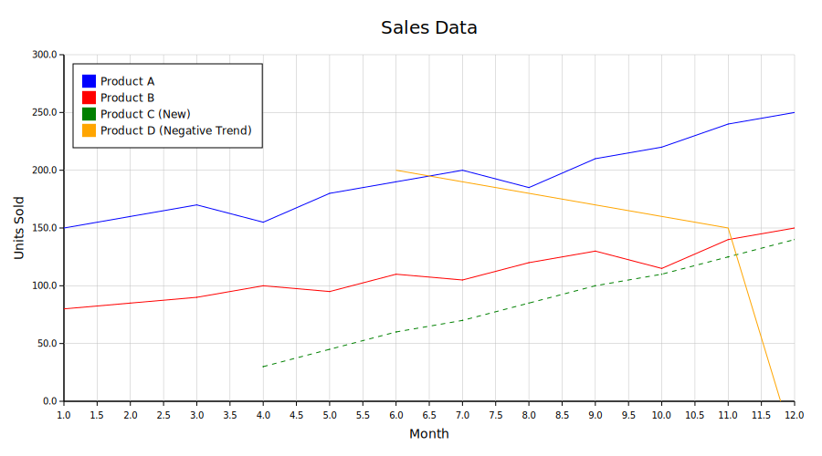

# Quill 🪶

A lightweight Rust plotting library for creating simple SVG 2D plots. Quill is designed for simplicity and ease of use, making it perfect for generating basic plots for reports, examples, or any application that needs clean, vector-based visualizations.

## Features

- 🎨 **Basic Styling**: Choose colors, marker types, and line styles
- 📏 **Simple Layouts**: Configurable dimensions, titles, axis labels, legends, and grids
- 🔧 **Builder Pattern**: Clean API with method chaining
- 📈 **Multiple Data Series**: Support for multiple datasets on a single plot
- 🖼️ **SVG Output**: Export to SVG files or return as `svg::Document` for programmatic use
- ⚡ **Lightweight**: Minimal dependencies for fast compilation

## Quick Start

Add Quill to your `Cargo.toml`:

```toml
[dependencies]
quill = "0.1.0"
```

### Basic Line Plot

```rust
use quill::*;

fn main() {
    let data = (0..=100).map(|x| {
        let xf = x as f64 * 0.1;
        (xf, xf.sin())
    }).collect();

    let plot = Plot::builder()
        .dimensions((600, 400))
        .title("Sine Wave".to_string())
        .x_label("X Axis".to_string())
        .y_label("Y Axis".to_string())
        .data(vec![
            Series::builder()
                .name("sin(x)".to_string())
                .color("Blue".to_string())
                .data(data)
                .line(Line::Solid)
                .build(),
        ])
        .build();
    
    plot.to_svg("output.svg").unwrap();
    
    // Or get the SVG document for programmatic use
    let svg_doc = plot.to_document();
}
```

## Examples

### Line Plot
A simple sine wave visualization with connected points:



```rust
use quill::*;

let line_plot = Plot::builder()
    .dimensions((600, 400))
    .title("Line Graph Example".to_string())
    .x_label("X Axis".to_string())
    .y_label("Y Axis".to_string())
    .legend(Legend::TopRightOutside)
    .grid(Grid::Solid)
    .data(vec![
        Series::builder()
            .name("Sine Curve".to_string())
            .color("Blue".to_string())
            .data(line_data())
            .marker(Marker::None)
            .line(Line::Solid)
            .build(),
    ])
    .build();
```

### Scatter Plot
Data points without connecting lines:


```rust
use quill::*;

let scatter_plot = Plot::builder()
    .dimensions((600, 400))
    .title("Scatter Graph Example".to_string())
    .legend(Legend::TopRightOutside)
    .grid(Grid::Dashed)
    .data(vec![
        Series::builder()
            .name("Lissajous Curve".to_string())
            .color("Red".to_string())
            .data(scatter_data())
            .marker(Marker::Circle)
            .marker_size(5.0)
            .line(Line::None)  // No connecting lines
            .build(),
    ])
    .build();
```

### Multi-Series Plot
Multiple datasets on the same plot:



```rust
use quill::*;

let plot = Plot::builder()
    .dimensions((900, 500))
    .title("Sales Data".to_string())
    .x_label("Month".to_string())
    .y_label("Units Sold".to_string())
    .legend(Legend::TopLeftInside)
    .grid(Grid::Solid)
    .data(vec![
        Series::builder()
            .name("Product A".to_string())
            .color("Blue".to_string())
            .data(product_a_data)
            .marker(Marker::Circle)
            .line(Line::Solid)
            .build(),
        Series::builder()
            .name("Product B".to_string())
            .color("Firebrick".to_string())
            .data(product_b_data)
            .marker(Marker::Square)
            .line(Line::Dotted)
            .build(),
        // Add more series as needed
    ])
    .build();
```

### Investment Growth Data
Points with different line styles:


```rust
use quill::*;

let plot = Plot::builder()
    .dimensions((800, 600))
    .title("Hypothetical Investment Growth".to_string())
    .x_label("Years".to_string())
    .y_label("Value ($)".to_string())
    .x_range(Range::Manual { min: 0.0, max: 10.0 })
    .legend(Legend::TopLeftInside)
    .grid(Grid::Dotted)
    .font("Times New Roman".to_string())
    .data(vec![
        Series::builder()
            .name("Low-Risk Investment".to_string())
            .color("Green".to_string())
            .data(low_risk_data)
            .marker(Marker::Circle)
            .line(Line::Solid)
            .build(),
        // Add more investment types
    ])
    .build();
```

## API Overview

### Plot Builder
Configure your plot with the builder pattern:

```rust
Plot::builder()
    .dimensions((width, height))           // Plot size
    .title("Plot Title".to_string())       // Chart title
    .x_label("X Axis".to_string())         // X-axis label
    .y_label("Y Axis".to_string())         // Y-axis label
    .x_range(Range::Auto)                  // X-axis range (Auto or Manual)
    .y_range(Range::Auto)                  // Y-axis range (Auto or Manual)
    .legend(Legend::TopRightOutside)       // Legend position
    .grid(Grid::Solid)                     // Grid style
    .font("Arial".to_string())             // Font family
    .margin(Margin::default())             // Plot margins
    .data(vec![series])                    // Data series
    .build()
```

### Series Builder
Define data series with markers and line styling:

```rust
Series::builder()
    .name("Series Name".to_string())       // Legend name
    .color("Blue".to_string())             // Line/marker color
    .data(vec![(x, y)])                    // Data points (f32, f64, i32, or i64 tuples)
    .marker(Marker::Circle)                // Point markers
    .marker_size(5.0)                      // Marker size
    .line(Line::Solid)                     // Line style (or Line::None for scatter)
    .build()
```

Note the Colors are derived from the `pigment` crate. More information at [pigment](https://github.com/crazywolf132/pigment).


### Output Options

```rust
// Save to SVG file
plot.to_svg("output.svg").unwrap();

// Get SVG document for programmatic use
let svg_doc: svg::Document = plot.to_document();
```

### Available Options

#### Markers
- `Marker::None` - No markers
- `Marker::Circle` - Circular points
- `Marker::Square` - Square points  
- `Marker::Cross` - Cross markers

#### Line Styles
- `Line::Solid` - Solid lines
- `Line::Dashed` - Dashed lines
- `Line::Dotted` - Dotted lines
- `Line::None` - No connecting lines

#### Grid Styles
- `Grid::Solid` - Solid grid lines
- `Grid::Dashed` - Dashed grid lines
- `Grid::Dotted` - Dotted grid lines
- `Grid::None` - No grid

#### Legend Positions
- `Legend::TopLeftInside`
- `Legend::TopRightInside`
- `Legend::TopRightOutside`
- `Legend::BottomLeftInside`
- `Legend::BottomRightInside`
- `Legend::BottomRightOutside`
- `Legend::LeftCenterInside`
- `Legend::RightCenterInside`
- `Legend::RightCenterOutside`
- `Legend::TopCenter`
- `Legend::BottomCenter`
- `Legend::None`

## Dependencies

Quill has minimal dependencies to keep your build fast:
- `bon` - For builder patterns
- `pigment` - For color handling
- `svg` - For SVG generation

## License

This project is licensed under the Apache-2.0 License - see the [LICENSE](LICENSE) file for details.

## Contributing

Contributions are welcome! Please feel free to submit issues, feature requests, or pull requests.
